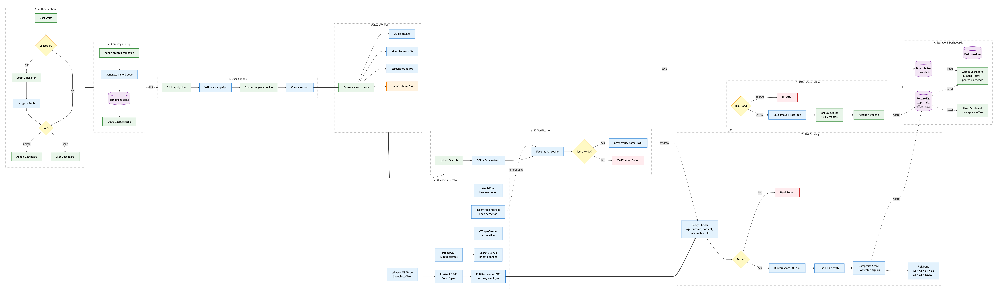

# LoanVision AI - An AI Video KYC Loan Platform

LoanVision AI is an end-to-end video-based digital loan origination system that conducts real-time Video KYC interviews with applicants using an AI conversational agent. It captures live video, performs face detection, liveness verification, ID document OCR, speech-to-text transcription, and automated risk scoring  - then generates personalized loan offers instantly with zero manual intervention.

Built with 6 open-source ML models running locally: Whisper V3 (STT), InsightFace ArcFace (face matching), MediaPipe (liveness), ViT (age/gender), PaddleOCR (ID extraction), and LLaMA 3.3 70B via Groq (conversational agent + risk classification).

## Flow Diagram



## Architecture Diagram


---

## Tech Stack

| Layer | Technology |
|-------|-----------|
| Frontend | React 19, Vite, TailwindCSS, Socket.IO Client |
| Backend | Express.js, Bun runtime, Socket.IO, Drizzle ORM |
| AI Service | FastAPI, Python 3.11 |
| Database | PostgreSQL 16, Redis 7.2 |
| ML Models | MediaPipe, ViT, InsightFace, PaddleOCR, Whisper |
| LLM | LLaMA 3.3 70B (via Groq API) |
| Infra | Docker Compose |

---

## Prerequisites

- **Docker & Docker Compose** (for PostgreSQL + Redis)
- **Bun** (v1.0+)  - [install](https://bun.sh)
- **Node.js** (v18+) and **npm**
- **Python 3.11** with `pip`

---

## Local Setup

### 1. Clone the repository

```bash
git clone https://github.com/Anamika1608/tenzorx-hack.git
cd tenzorx-hack
```

### 2. Start PostgreSQL & Redis (Docker)

```bash
cd server
docker compose up -d postgres redis
```

This starts:
- **PostgreSQL 16** on `localhost:5432` (user: `postgres`, password: `password123`, db: `postgres`)
- **Redis 7.2** on `localhost:6379`
- **Adminer** (DB admin UI) on `localhost:8085` (optional)

### 3. Set up the Backend Server

```bash
cd server
```

Create `.env.local` with:

```env
NODE_ENV=development
EXPRESS_ENV=development
EXPRESS_SERVER_PORT=3001

POSTGRES_HOST=localhost
POSTGRES_PORT=5432
POSTGRES_DATABASE=postgres
POSTGRES_USER=postgres
POSTGRES_PASSWORD=password123
POSTGRES_POOL_MAX_SIZE=10
POSTGRES_IDLE_TIMEOUT_IN_MS=30000
POSTGRES_CONN_TIMEOUT_IN_MS=5000

REDIS_HOST=localhost
REDIS_PORT=6379
REDIS_SECRET=loanvision_session_secret_dev
REDIS_MAX_CONNECTION_RETRY=10
REDIS_MIN_CONNECTION_DELAY_IN_MS=1000
REDIS_MAX_CONNECTION_DELAY_IN_MS=30000

JWT_SECRET=your_jwt_secret
JWT_REFRESH_TOKEN=your_refresh_token_secret
JWT_ACCESS_TOKEN=your_access_token_secret

WINDOW_SIZE_IN_SECONDS=60
MAX_NUMBER_OF_REQUESTS_AUTH_USER_PER_WINDOW_SIZE=100
MAX_NUMBER_OF_REQUESTS_NOT_LOGGEDIN_USER_PER_WINDOW_SIZE=30
```

Install dependencies and run migrations:

```bash
bun install
bunx drizzle-kit generate:pg
bunx drizzle-kit push:pg
```

Seed the admin user:

```bash
bun run src/db/seed-admin.ts
```

Start the server:

```bash
bun run dev
```

Server runs on `http://localhost:3001`.

### 4. Set up the AI Service

```bash
cd ai-service
python3 -m venv .venv
source .venv/bin/activate
pip install -r requirements.txt
pip install insightface paddleocr
```

Create `.env` with:

```env
GROQ_API_KEY=your_groq_api_key
HF_TOKEN=your_huggingface_token
REDIS_HOST=localhost
REDIS_PORT=6379
AI_SERVICE_PORT=8000
NODE_SERVER_URL=http://localhost:3001
```

You need a **Groq API key** from [console.groq.com](https://console.groq.com) (free tier available) and a **HuggingFace token** from [huggingface.co/settings/tokens](https://huggingface.co/settings/tokens) for model downloads.

Start the AI service:

```bash
python start.py
```

On first run, it downloads ML models (~2-3 GB) and preloads them into memory. The service is ready when you see `All models ready`. Runs on `http://localhost:8000`.

### 5. Set up the Frontend Client

```bash
cd client
npm install
npm run dev
```

Client runs on `http://localhost:3000`. Vite proxies API requests to the backend (`:3001`) and AI service (`:8000`) automatically.

---

## Running the Full Stack

Start all three services in separate terminals:

```bash
# Terminal 1  - Database
cd server && docker compose up -d postgres redis

# Terminal 2  - Backend
cd server && bun run dev

# Terminal 3  - AI Service
cd ai-service && source .venv/bin/activate && python start.py

# Terminal 4  - Frontend
cd client && npm run dev
```

Open `http://localhost:3000` in your browser.

---

## Testing the Application

### Admin Flow

1. Login at `http://localhost:3000/login`
   - Email: `admin@loanvision.ai`
   - Password: `Admin@1234`
2. You'll be redirected to the **Admin Dashboard**
3. Click **Create Campaign** to create a loan campaign (set name, channel, max uses, expiry)
4. The campaign generates a shareable link: `/apply/<campaign-code>`

### User Flow

1. Register at `http://localhost:3000/register` (any name/email/password)
2. You'll be redirected to **My Applications**
3. Click **Apply Now** to start a loan application
4. The **Video KYC Call** page opens:
   - Grant camera + microphone permissions
   - The AI agent asks questions conversationally (name, income, employer, loan purpose)
   - Face detection runs in real-time (bounding box + age/gender)
   - A liveness check (blink detection) triggers at ~15 seconds
   - A screenshot is captured at ~10 seconds
5. Upload your **Government ID** when prompted
   - OCR extracts text, face is matched against your live video
6. After the call ends, the system:
   - Runs **policy checks** (age, income, consent, LTI ratio)
   - Generates a **bureau score** (simulated 300-900)
   - **LLM risk classification** assigns a risk band (A1-C2 or REJECT)
   - Calculates a **composite score** from 6 weighted signals
7. If approved, you see a **loan offer** with amount, interest rate, EMI, and tenure options
8. Accept or decline the offer

### Verifying Services

Check that all services are healthy:

```bash
# Backend health
curl http://localhost:3001/api/v1/auth/me

# AI service health (shows model load status)
curl http://localhost:8000/health

# Database (Adminer UI)
open http://localhost:8085
```

---

## Ports Summary

| Service | Port |
|---------|------|
| Frontend (Vite) | 3000 |
| Backend (Express) | 3001 |
| AI Service (FastAPI) | 8000 |
| PostgreSQL | 5432 |
| Redis | 6379 |
| Adminer (DB UI) | 8085 |

---

## Project Structure

```
tenzorx-hack/
├── client/                  # React frontend
│   ├── src/
│   │   ├── pages/           # Login, Register, VideoCall, Dashboard, etc.
│   │   ├── hooks/           # useAudioCapture, useFaceAnalysis, useLiveness, etc.
│   │   ├── components/      # AgentBubble, TranscriptPanel, FaceIndicator, etc.
│   │   ├── context/         # AuthContext (session management)
│   │   └── lib/             # API client, frame capture, WAV encoder
│   └── vite.config.ts       # Dev server + proxy config
├── server/                  # Express backend
│   ├── src/
│   │   ├── routes/api/      # auth, campaign, session, application, dashboard
│   │   ├── controller/      # Business logic for each route
│   │   ├── model/           # Drizzle ORM schemas (users, sessions, applications, etc.)
│   │   ├── middleware/      # Auth checks, rate limiting, validation
│   │   ├── socket/          # WebRTC signaling + real-time events
│   │   └── db/              # Database connection, Redis, migrations, seed
│   ├── drizzle/             # SQL migration files
│   └── docker-compose.yml   # PostgreSQL + Redis containers
├── ai-service/              # Python AI microservice
│   ├── routers/             # /stt, /cv, /llm endpoints
│   ├── services/            # whisper, face_analysis, liveness, id_ocr, llm_agent
│   ├── start.py             # Entry point (preloads models + starts server)
│   └── requirements.txt     # Python dependencies
├── loanvision-flow.png      # System flow diagram
└── loanvision-arch.png      # Architecture diagram
```
